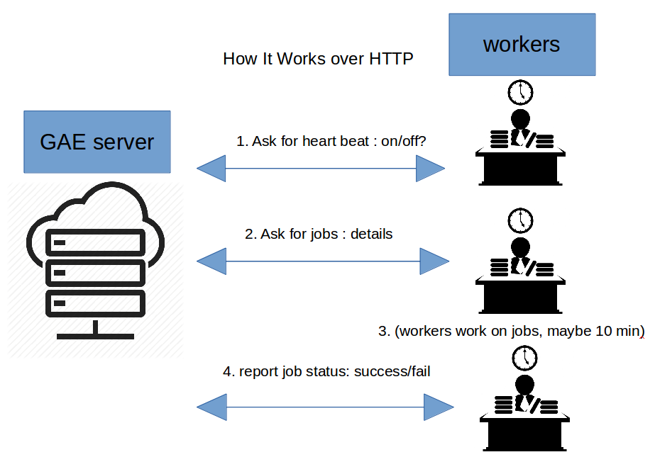

## GAE heartbeat and jobqueue  module
Google App Engine (GAE) `heartbeat` api and `jobqueue` api for workers to pull.

### How it works

### `heartbeat` module
I design this `heartbeat` module to solve this problem:

1. Server publish a `heartbeat` info, which contains `name`, `is_on`, `come_back`.
2. `is_on` indicates that if the worker shall wake up and feth jobs or not.
3. `come_back` indicates the minutes interval worker shall come back to check the heartbeat.
4. `name` is the name of the `heartbeat`.

How this will work in real life:

1. I have a `heartbeat` which `name` is cat.
2. At 8:00 I adjust it to `is_on=True`, `come_back=5`. So the worker come back every 5mins and do the job.
3. At 19:00 I adjust it to `is_on=False`, `come_back=20`, so the worker is going idle and come back every 10 mins.
4. At 7:30 I adjust it again to `is_on=False`, `come_back=5`, so the worker is idle but come back more frequently.
5. You can adjust the above paremeters through web page api or GAE cron jobs.

### `jobqueue` module
I design this `jobqueue` module to solve this problem:

1. Admin User adds jobs onto the server.
2. Workers, if wake up, pull the job queue via http. Get a list of jobs.
3. Workers get the job excecuted, this process may take up to 10mins, or even weeks.
4. Workers report the success/failure of each job, via http. This is called "update job status".

### Code structure

1. `main.py` the main entrance of whole GAE application.
2. `/heartbeat` the source code of `heartbeat` database structure and http json web handlers.
3. `/jobqueue` the source code of `jobqueue` database structure and http json web handlers.
4. `/human` the source code of http web handlers, for admins to call to visualize the status.
5. `/html` where the html, javascript, and css files are.

### How to use?

You can copy-paste the `/heartbeat`, `/jobqueue` folder into your project, they doesn't depend on other folders. :D
